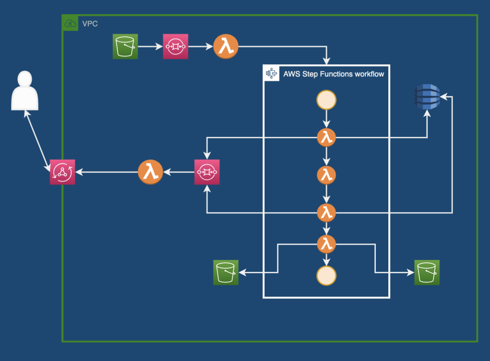

# Running ML Models Serverless On AWS

This repo contains a sample application to run a simple ML model on AWS Lambda which decides if a given image is cat or dog.

This code used to deploy [demo of presentation on Berlin AWS User Group](https://www.linkedin.com/feed/update/urn:li:activity:7037456380743544832?utm_source=share&utm_medium=member_desktop) on 14.03.2023.

Model belongs to Carlos Aguayo  can be found on [HuggingFace](https://huggingface.co/carlosaguayo/cats_vs_dogs).

This is the overview of the CDK configured infrastructure for application.

Here is the [link](https://docs.google.com/presentation/d/e/2PACX-1vQleJAJGgEZdN890oRH6Vua-WpsMSFwmHZIg-bKhnfkTQmbPRW20uspFZ-_3cN4eg/pub?start=false&loop=false&delayms=3000) for the presentation. 

If you want to use this sample CDK code; 
1. Configure AWS credentials locally
2. Login to your AWS account from AWS CLI.
3. Deploy stack using `cdk deploy` command.